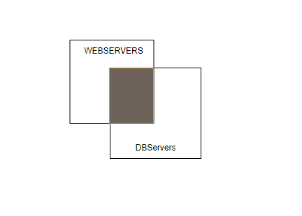

Introducción a los playbooks
===

- Un *Playbook* o Libro de juegos debe entenderse como la *la lista de tareas* que va n a realizarse sobre un conjunto de servidores especificados.

- Incluye tanto Configuraciones y variables.

- Se escriben en Formato YML (Ain't Markup Language)

````
myplaybook.yml
---- Indica el comienzo del fichero
- name: My FirstPLaybook
  host: all
  remote_user: benauca
  become: true
  task: 
    -name: copy file
    copy: src="/etc" dest="/etc/..."

... Indica el final del fichero
````


La ejecución 
````
ansible-playbook [-i inventario] [opciones] myplaybook.yml
````

Elementos Esenciales
----
host:   Lista de servidores sobre los que vamos a ejecutar las tareas. es posible indicar grupos o servidores individuales.

- Caracteres especiales: & ( Y ) ! (Negación)

En el siguiente ejemplo, vemos como apliaca a todos los servidores incluidos en los grupos webservers y dbservers. 



Ejemplos
```
---
# This playbook deploys the whole application stack in this site.

- name: configure and deploy the webservers and application code
  hosts: webservers:&dbservers
  remote_user: root

  roles:
    - web
    - db

```
En el caso

host: webserver:!dbservers aplicará a todos los servidores que pertenezcan al grupo webservers a excecpción de los que pertenezcan a dbservers


- host: webservers:dbservers Aplicará todos los servidores de los dos grupos.

Comando

```
ansible-playbook [OPCIONES] fichero.yml
```

OPCIONES
---
* - -i  -------------------- Especifica el inventarios

        | ------------------ Fichero
        | ------------------ Script
        | ------------------ Combinación de ambos

* --syntax-check ----------- Verifica la sintaxis del playbook
* --list-task   ----------------- Listamos la tareas de nuestro playbook


Podemos tener varios playbooks en e mismo fichero . o tenerlo separado en varios ficheros
```
----
    - name: playbook-1
      tasks:
    - name: playbook-2
       tasks: 
....
```
* --step ----------------- Pide confirmación para ejecutar la tarea paso a paso.

* --start-at-task -------- Nos permite empezar a ejecutar el playbook en una tarea obviando la ejecución de las tareas anteriores.
* -- fork ---------------- Limitar tareas en paralelo (Por defecto 5)
* -v (vvv) --------------- Modo verbose

        | ---------------- -vv Muestra más info que -v
        | ---------------- -vvv Muestra más info que -vv

VARIABLES
---

* Una variable contiene un valor modificable
* Nos ayudan a modificar las tareas de forma dinámica

Casos de Uso
---
* Definir el puerto de una aplicación
* Indicaar usuarios
* cambiar rutas de ficheros de configuraciones

Pueden ser definidas en
- Facts (servidor ) ansible_host
                    ansible_port
- Playbook
- Linea de comando ( -e clave / valor )

Pueden usar como  " {{variable}}" en
- tareas
- plantillas
- Otros ( Condiciones, bucles, etc)

SINTAXIS
---

- YML   Simplifica la definicion de los playbooks
- Mejora la legibilidad de los ficheros
- Formato para los argumentos

```
-name: .......................
copy:
   src: 
   dest: 
   owner:
   group:
   mode:

-name_ ...................
  template: 
   src:
   dest: 
   owner:
   group:
``` 

Lista:
    Instalar:

          -apache
          -mariadb
          -php5

Similar a 

instalar: [ "apache", "mariadb", "php5"]

Diccionario
---
- Mapeamos claves/valor

    instalar:
        web: aoache2
        db: mariadb
        script: php5

Texto Largo
---

"|" (Pipe) Un texto largo de varias lineas

">" Lineas muy largas sin salito de linea.

Debug:
    -debug var=milista

HANDLERS
===
Los handlers son similares a las tareas, pero sólo se ejecutan cuando otra tarea lo llaman

Caso de Uso
---
- Reiniciar un servicio si la configuración ha sido cambiada

```
task: 
    -name: Configurar SSMD
     copy:
      src: sshd-config
      dest: /etc/sshd-config
    notify: reiniciar-sshd
```

Hace referencia a un handlers

```
handlers:
    - name: reiniciar-sshd
      service: 
        name: sshd
        state: restarted
```

> Los handlers siempre se ejecutan al final del playbook

De esta forma evitamos tener que llamar muchas veces al mismo handler.

Include Y Roles
---

Es posible dividir un playbook en distintas partes para facilitar la edición, y mejora el trabajo en paralelo.

`include` Especificamos otro fichero que contiene playbook o una tarea.

```
file 1

tasks:
    -name:
    copy:
    include: file2.yml
```

```
file2

    -name:..........
    -service: -----------

```

`Roles` Podemos crear una estructura de directorios y ficheros para separar los elementos facilitando
- reutilizacion
- Uso de roles predefinidos en internet
- Consumo del repositorio de roles `Ansible Galaxy`. 


Estructura de Los Roles
---


```
--  roles/
----    nombre_rol/
------      files/ 
------      templates/
------      tasks/          
--------      main.yml       
------      handlers/          
--------      main.yml      
------      vars/          
--------      main.yml      
------      defaults/          
--------      main.yml      
------      meta/          
--------      main.yml      
```

De esta manera dentro del playbook en lugar de hacer referencia a la tarea haremos referencia a los roles.

roles:
    - rol1
    - rol2
    - rol3

Si quisieramos pasar variables

roles:
    - {role: rol1, clave: valor }

Templates
===

Los templates es la manera dinámica de usas variables.
La extension de las templates es `*.j2`
Dentro de una plantilla podremos usar las siguientes instrucciones

* Expresiones {{variable}} => {{ansible_fqdn}}
* Control  donde la expresión de Control puede ser una condición

```

    //Mostrar solo en sistemas  Debian

```

Otro ejemplo

```
list_1 definida en defaults/main.yml


    {{usuario}}

```

* Comentarios: No son visibles.
```
 {#Mi Comentario#}
```


Ejemplo
---
```
-name: Copiar Fichero index.html
 template:
     src: index.html.j2
     dest: /var/www/html/index.html
```

Prioridad de las Variables
===

- La siguiente lista muestra la prioridad de las variables de `MENOS a MAS`

* Variables Defaults definidas en un rol
* Variables de Grupo
* * Inventario => Groups_vars / all => groups_vars/group
* Variables de un servidor
* * Inventario => host_vars/servidor
* "Facts" del servidor
* Variables del Playbook
* * vars_promp => vars_files
* Variables de Role
* * /roles/rol/vars/main.yml
* Variables de Bloque
* * Variables de tareas
* Parámetros de Role
* * Include_params => include_vars
* set_facts / registered_vars
* extra_vars (linea de comandos)
    !! Siempre Ganan ¡¡

Condiciones
===
Es posible condicionar la ejecución de una tarea con el uso de un fichero o rol usando la expresión `when`

```
-name: instalar apache2
 apt: name=apache2 state=latest
 when: ansible_distribution=="Debian"

```
Se pueden añadir más condiciones haciendo uso de `OR`

```
-name: instalar apache2
 apt: name=apache2 state=latest
 when: ansible_distribution=="Debian" or ansible_distribution=="Ubuntu"
```

En Centos recordad que habría que usar el modulo `yum` en lugar de `apt`

```
-name: instalar http
 yum: name=httpd state=latest
 when: ansible_distribution=="Centos"
```

> Se pueden hacer tambien condiciones a nivel de includes, y roles, y No sólo de tarea.

```
-name: instalar apache
 include: instalar-apache2.yml
 when: ansible_distribution=="Debian"
```

En el caso de los roles, en nuestro playbook principal (main.yml) tendríamos algo similar a:

roles:
    - {
        role: apache2, when:ansible_distribution=="Debian"
    }

Bucles
===

- Hemos visto como usar los bucles dentro de las plantillas.
- Veamos como se usan dentro de las tareas
- Para las listas y diccionarios usamos las expresión `with_items`

```
-name: Instalar Software
 apt: name= {{item}} state=latest
 with_items: 
    - mariadb
    - php5
    - phpmyadmin
```


Ejemplo Diccionarios
```
-name: Crear Usuarios
 user: name={{item_nombre}} state=present groups={{item_group}}
 with_items:
    - {nombre: user1, grupo: grupo1}
    - {nombre: user2, grupo: grupo2}
```

Register
===

Nos permite registra en una variable el resultado de la acción realizada por unmodulo en una tarea.

Voy a crear una variable de nombre output donde asignar´r la hora. 

```
-name: Ejecutar comando
 command: uptime
 register: output 
-name: mostrar
 debug: var=output
```

Similar a hacer var=output.stdout


* Valores defectos por tarea
* * CHANGED (true cuando hemos cambiad0)
* * FAILED
* * SKIPPED
* * stdout, stdout_line, stderrors

- De esta manera podremos condicionarlo de la siguiente manera.

- when: output | changed

```
-name: copiar fichero
 template: src=index.html.j2 dest=.........
 register: copiado
-name: print
 debug: copiado
 when: copiado|changed
```


En este caso copiado será true cuando copiamos el contenido.

Ignore Errors
===
Hasta ahora hemos visto como cuando una tarea falla se deiene laejecución de las siguientes tareas.

- La expresión `ignore_errors` permite ignorar una tarea marcada como error y seguir con la ejecución de las siguientes tareas.

Existen modulos para verifcar si un fichero existe mejor que kanzar un comando ls, pero a modo de ejemplo podremos ver el siguiente

```
- name: exist file
 command: ls ./noexisto.cfg
 register: isExist
 ignore_errors: true
```

Es posible usar la condicion

```
when: not isExist|failed 
```
para realizar una tarea dependiente.


Failed When
===
Las expresiones
 - failed_when
 - changed_when
 

 permiten especificar las condiciones para marcar una tarea como "fallida" o "cambiada"

 - Comando => Será marcado como KO si el rc!=0

 Si quisieramos cambiar el control de como gestionar el error

 ```
 -name: Ejecutar Comando
  command: ip a
  register: myOutput
  failed_when: "'eth2' not in myOutput.stdout"

  -name: No marca nunca como cambiado
   command: uptime
   changed_when:false
```
